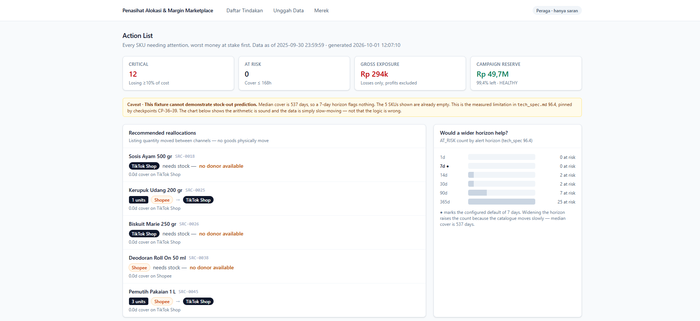
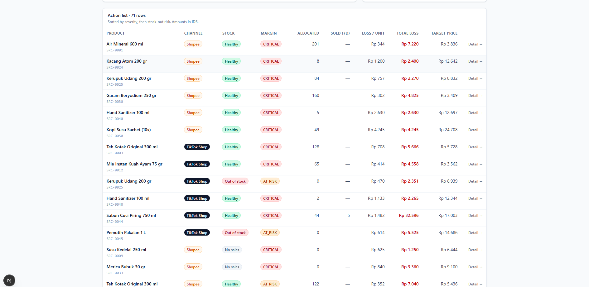
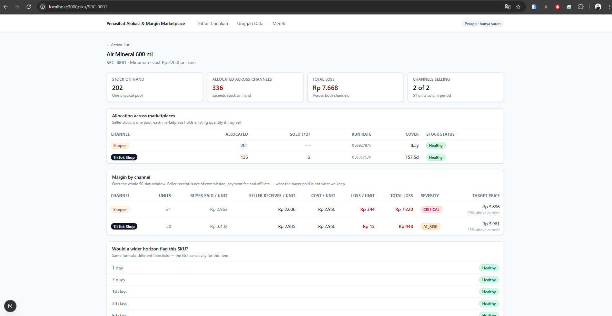
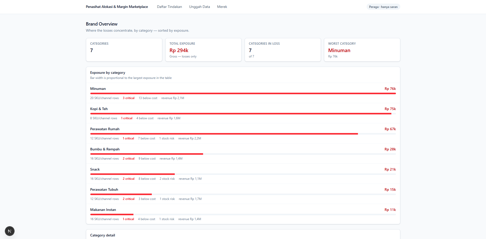
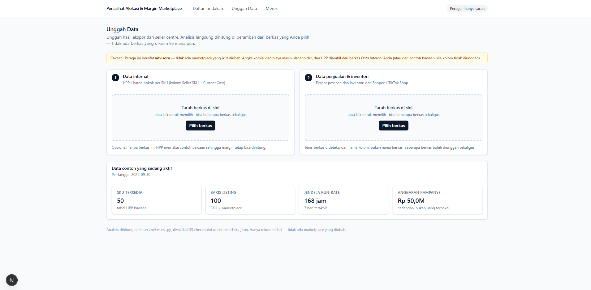

# Marketplace Allocation & Margin Advisor — Web App

Next.js dashboard for Account Managers (AMs) who run a brand across **Shopee,
TikTok Shop and Tokopedia** in the Indonesian market. It surfaces two problems in one
view:

1. **Stock-out risk** — an allocated listing quantity that will run dry soon.
2. **Below-cost selling** — SKUs whose receipt (after commission and fees) is under HPP.

Everything here is **advisory only**. No marketplace is ever written to; the AM
decides and executes in the seller centre.

---

## Daftar Isi

- [Quick start](#quick-start)
- [Pages at a glance](#pages-at-a-glance)
- [1. Daftar Tindakan — `/`](#1-daftar-tindakan--)
  - [Ringkasan tiles](#ringkasan-tiles)
  - [Batas peraga (caveat)](#batas-peraga-caveat)
  - [Recommended reallocations](#recommended-reallocations)
  - [Would a wider horizon help?](#would-a-wider-horizon-help)
  - [Tabel daftar tindakan](#tabel-daftar-tindakan)
- [2. Detail SKU — `/sku/[sku]`](#2-detail-sku--skusku)
  - [Ringkasan tiles](#ringkasan-tiles-1)
  - [Allocation across marketplaces](#allocation-across-marketplaces)
  - [Margin by channel](#margin-by-channel)
  - [Would a wider horizon flag this SKU?](#would-a-wider-horizon-flag-this-sku)
- [3. Merek — `/brands`](#3-merek--brands)
  - [Ringkasan tiles](#ringkasan-tiles-2)
  - [Exposure by category](#exposure-by-category)
  - [Category detail](#category-detail)
- [4. Unggah Data — `/upload`](#4-unggah-data--upload)
  - [Dua zona unggah](#dua-zona-unggah)
  - [Bagaimana berkas dikenali](#bagaimana-berkas-dikenali)
  - [Yang ditampilkan setelah unggah](#yang-ditampilkan-setelah-unggah)
- [Architecture: why the upload page computes in the browser](#architecture-why-the-upload-page-computes-in-the-browser)
  - [Formula parity](#formula-parity-ported-from-srcmetricspy)
  - [`seed.json` vs `analysis.json`](#seedjson-vs-analysisjson)
- [Known limits](#known-limits-inherited-not-introduced-here)
- [Project layout](#project-layout)
- [Stack](#stack)
- [Scripts](#scripts)

> **Screenshots.** The images below live in [`public/img/`](public/img/). Each page
> section shows at least one; `actionlist.png` / `action.png` are the top and bottom of
> the same Daftar Tindakan page.

---

## Quick start

```bash
# From the repository root
python src/generate.py           # 1. build the fixture CSVs in data/
python src/build_analysis.py     # 2. build web/public/analysis.json + seed.json
npm --prefix web run dev         # 3. http://localhost:3000
```

> On Windows, `npm --prefix <abs path> run dev` is the reliable form. A plain
> `cd web; npm run dev` loses the working directory in some terminal integrations.

---

## Pages at a glance

| # | Route | Page | Answers the question |
|---|---|---|---|
| 1 | `/` | **Daftar Tindakan** | What do I do today, worst money first? |
| 2 | `/sku/[sku]` | **Detail SKU** | Why is *this* SKU flagged, and on which channel? |
| 3 | `/brands` | **Merek** | Where do the losses concentrate, by category? |
| 4 | `/upload` | **Unggah Data** | Here is today's export — analyse it now. |

Everything except `/upload` reads the pre-computed `web/public/analysis.json`. The
upload page parses and computes in the browser (see
[Architecture](#architecture-why-the-upload-page-computes-in-the-browser)).

---

## 1. Daftar Tindakan — `/`

> The landing page and the "one view" the PRD asks for: every SKU/channel pair that
> needs attention, ranked by money at stake, then stock risk.



_Top of the page: the four tiles, the §6.4 caveat, the reallocation card and the horizon chart._



_The action list itself — one row per SKU/channel, worst money first._

**What makes it a to-do list, not a report**

- Only *actionable* rows appear — a row is included when it is below cost
  (`AT_RISK` / `CRITICAL` / `WATCH`) **or** at stock risk (`AT_RISK` / `OUT_OF_STOCK`).
  Profitable, healthy SKUs are filtered out, so the list stays short by design.
- Sort order is `severity × 2 + stockout_rank`, so a SKU that is both losing money and
  running dry floats to the top. The ranking lives in `src/build_analysis.py`.
- The header shows both `data as of` and `generated at`, so a stale payload is obvious.

### Ringkasan tiles

Four headline figures across the top:

| Tile | Meaning | Tone |
|---|---|---|
| **Critical** | Rows losing **≥ 10 % of cost** | red when > 0 |
| **At risk** | Rows whose cover is **≤ alert horizon** (default 168 h) | neutral |
| **Gross exposure** | `Σ max(0, loss)` — losses only, profits excluded | red |
| **Campaign reserve** | Budget − exposure, with % left and status | good / warn / bad |

Gross exposure uses **losses only** on purpose: a profit on one SKU does not restore
the campaign reserve that another SKU drained (§7.4).

### Batas peraga (caveat)

A deliberate amber banner states that **this fixture cannot demonstrate stock-out
prediction** — median cover is ~537 days, so a 7-day horizon flags nothing, and the
`OUT_OF_STOCK` rows shown are *already* empty. This is the measured limitation in
`tech_spec.md` §6.4, pinned by checkpoints **CP-36…CP-39**. The banner exists so an
empty horizon result is never mistaken for a bug in the logic.

### Recommended reallocations

For every troubled SKU the build picks the best **donor** channel and shows the move as
`N units · From → To`, with the reason (`"X d cover on <channel>"`).

- A move is capped by the donor's **surplus above its own target cover** (14 days) — a
  donor never dips below its own safety line.
- When no channel has surplus, the card reads **"no donor available"** (the
  recommendation is `blocked`) instead of showing a meaningless `0 units`.
- **Listing quantity moves, not goods.** The subtitle says so explicitly: one physical
  stock pool; marketplace allocation is just how many units each channel may sell.

### Would a wider horizon help?

`HorizonChart` plots the **AT_RISK count at six horizons** (1 d, 7 d, 14 d, 30 d, 90 d,
365 d). It exists to make §6.4 visible: the count rises as the horizon widens, proving
the formula is sound and the data is simply slow-moving. The configured default
(7 days) is marked with a `●` and a darker bar.

### Tabel daftar tindakan

One row per SKU/channel, each linking through to the SKU detail page.

| Column | Source | Note |
|---|---|---|
| Product | name + internal `sku` | links to `/sku/[sku]` |
| Channel | `channel` | Shopee / TikTok Shop tag |
| Stock | `stockout_status` | stock badge |
| Margin | `severity` | severity badge |
| Allocated | `allocated` | listing quantity |
| Sold (7d) | `sold_units_window` | the run-rate window |
| Loss / unit | `under_cogs_per_unit` | `—` when profitable |
| Total loss | `under_cogs_total` | red, `—` when profitable |
| Target price | `recommended_price` | `—` unless below cost |
| → | — | detail link |

A closing footnote states that commission rates are placeholders and that **every
figure was computed in `src/metrics.py`, none recalculated in the browser**.

---

## 2. Detail SKU — `/sku/[sku]`

> The "why" behind a flagged row: how one SKU behaves on *each* marketplace.



Pre-rendered for **every** SKU at build time via `generateStaticParams()`, so the page
is static HTML. An unknown SKU returns `notFound()`.

### Ringkasan tiles

| Tile | Meaning |
|---|---|
| **Stock on hand** | Physical units — **one pool**, not per channel |
| **Allocated across channels** | Sum of allocations; flags **"Exceeds stock on hand"** in red when the PRD constraint is breached |
| **Total loss** | `Σ max(0, under_cogs_total)` across channels |
| **Channels selling** | `n of m` channels with period sales, plus total units sold |

The allocation-constraint tile is the important one: it encodes the PRD rule that
`Σ allocations ≤ stock on hand`. Oversubscription is a real, visible error state, not a
warn-and-continue.

### Allocation across marketplaces

Per-channel listing view: **Allocated · Sold (7d) · Run rate (/h) · Cover · Stock
status**. Run rate is shown to 5 decimals because on this fixture velocity is genuinely
tiny (the fastest pair is 0.0139 units/hour). Cover is rendered by `coverDays()`, which
switches to hours under a day and years above a year.

### Margin by channel

The money view, over the **whole 90-day window**:

`Units · Buyer paid / unit · Seller receives / unit · Cost / unit · Loss / unit ·
Total loss · Severity · Target price`

The subtitle spells out the core lesson: **"what the buyer paid is not what we keep."**
Seller receipt is net of commission, payment fee and affiliate. Target price shows the
delta as *"N % above current"*.

> **Window-coherence rule.** Margin columns are gated on `sold_units_period` (the full
> period), **not** `sold_units_window` (7 days). Gating on the 7-day window once
> produced rows showing a loss with no price behind it. Whenever two figures share a
> row, verify they share a window.

### Would a wider horizon flag this SKU?

The same six horizons for *this* SKU, each with a stock badge — the per-item view of
the §6.4 sensitivity shown in aggregate on the landing page.

A footnote states the cost basis: weighted average from
`data/internal/cogs_ledger.csv`.

---

## 3. Merek — `/brands`

> Where the losses concentrate. Groups the catalogue by category and sorts categories
> by exposure, so the AM can see which parts of the brand need attention first.



### Ringkasan tiles

**Categories · Total exposure · Categories in loss · Worst category.**

### Exposure by category

A ranked list where each row is:

- category name + exposure (red),
- a **proportional bar** (width relative to the largest category),
- a meta line: `N SKU/channel rows`, `N critical` (red), `N below cost`, `N stock risk`,
  `revenue …`.

### Category detail

Collapsible `<details>` per category (native, no JS). Expanding lists every SKU/channel
row in that category, **sorted worst-loss-first**, each linking to its SKU detail page
and showing either `−Rp…` or the word **"profitable"**.

---

## 4. Unggah Data — `/upload`

> The AM's real trigger is a **manual export drop** — there is no scheduler and no API.
> This is the one page that does not just render the pre-computed payload: it parses
> the files you choose and analyses them immediately.



_The two numbered drop zones and the "Data contoh yang sedang aktif" card shown before any upload._

All copy on this page is **Bahasa Indonesia**. Files never leave the browser.

### Dua zona unggah

Two clearly numbered drop zones, each with drag-and-drop **and** click-to-browse, plus
removable file chips (re-dropping the same filename replaces it):

| Step | Zone | What goes in | Required? |
|---|---|---|---|
| **1** | **Data internal** | Cost / HPP per SKU. Accepts `products_internal_cost.csv`, `cogs_ledger.csv`, `products_master.csv` (any file with `Seller SKU` **and** a recognised cost column) | Optional |
| **2** | **Data penjualan & inventori** | Seller-centre exports from Shopee / TikTok Shop — order files and inventory files, any number of them | Practically required to get rows |

With **no** internal file, the cost table falls back to the bundled `seed.json`
catalogue, so a sales-only upload can still be priced (the page says so in a caveat).
A **Bersihkan** button appears once any file is present.

### Bagaimana berkas dikenali

Files are identified **from their columns, never their filename**. Inventory columns
are checked before order columns — mistaking an inventory export for an order export
silently zeroes every allocation, which is exactly the bug found and fixed in the
server-less `simple/` page.

| Marketplace | Order-file columns | Inventory-file columns |
|---|---|---|
| Shopee | `SKU Reference No.`, `Deal Price`, `Parent SKU` | `Parent SKU`, `Stock`, `Reserved Stock`, `Available Stock` |
| TikTok Shop | `Order Substatus`, `SKU ID`, `Seller SKU` | `Seller SKU`, `Inventory`, `Available Inventory` |

Recognition rules:

- **Inventory first.** Order statuses are filtered to genuinely-sold ones (Shopee:
  `Completed` / `Shipped`; TikTok: `Completed` / `In Transit`); the net is
  `Quantity − Returned Quantity`.
- **Cost lookups** try, in order: `Current Cost` → `Unit Cost (WA)` → `Standard Cost` →
  `Cost Price`. The COGS ledger has one row per month, so the latest month wins.
- **TikTok inventory is summed** across warehouses (one listing, several rows).
- An unknown file is listed with a red **"kolom tidak dikenali"** badge rather than
  being silently dropped.

### Yang ditampilkan setelah unggah

1. **Ringkasan hasil unggahan** — tiles: *Perlu tindakan · Di bawah HPP · Total
   kerugian · Sisa anggaran kampanye* (reserve status in Indonesian: `AMAN` /
   `PERHATIAN` / `TERLAMPAUI`).
2. **Berkas yang dibaca** — every file with its detected type (Data internal /
   Penjualan & inventori / pesanan / inventori, plus marketplace) and its row count or
   rejection reason.
3. **Caveats** — shown when costs came from the bundled catalogue, and for **orphan
   SKUs** (in an export but absent from the cost table), listed by code.
4. **Daftar tindakan** — the uploaded rows ranked by money lost, then stock risk; same
   columns and Indonesian badges as the dashboard.

With no files yet, the page shows a neutral **"Data contoh yang sedang aktif"** card
(seed date, SKU count, listing count, run-rate window, campaign budget) so it is never
empty on open.

---

## Architecture: why the upload page computes in the browser

`src/build_analysis.py` **pre-computes** `web/public/analysis.json`, and the dashboard
pages only render that payload. Every number in it was produced by `src/metrics.py` —
the module protected by the **39 checkpoints** in `checkpoint.json`. That is deliberate:
there must be only one copy of the maths wherever it can be avoided.

A file the AM drops **now**, however, cannot have been pre-computed by a Python build
that ran earlier, and this prototype has no server. So the upload page recomputes in
the browser, in `web/src/lib/upload.ts`. The same port already exists for the
server-less page in `simple/_skrip.js`.

> **This is a second copy of the logic.** If you change a band, a fee split or the
> window/fallback rule, update **all three** copies — `src/metrics.py`,
> `simple/_skrip.js` and `web/src/lib/upload.ts` — together.

### Formula parity (ported from `src/metrics.py`)

| Concern | Rule | Spec |
|---|---|---|
| Variable fees | `commission + payment + affiliate`; the **admin fee is fixed per order**, never a rate | §5.1 |
| Seller receipt | `price × (1 − variable) − admin_fee / units` | §5.1 |
| Run rate | `units / observation_hours`; recent 7-day window first, then a 30-day fallback | §6.1 |
| Stock-out | dormant → out-of-stock → at-risk (`cover ≤ horizon`) → healthy. Order matters | §6.3 |
| Loss per unit | `cost − seller_received_per_unit` (positive = below cost) | §7.2 |
| Severity | Against **cost**, not price: `CRITICAL` > 10 %, `AT_RISK` ≤ 10 %, `WATCH` −5 %…0 %, else `OK` | §7.3 |
| Target price | `(cost × (1 + margin) + admin_fee/unit) / (1 − variable_rate)` — split numerator on purpose | §7.5 |
| Gross exposure | `Σ max(0, loss)` — a profit elsewhere does not restore the reserve | §7.4 |
| Reserve status | `HEALTHY` > half left, `CAUTION` otherwise (exactly half is CAUTION), `BREACHED` at zero | §8.2 |

**Verified parity.** Uploading the fixture in the browser reproduces the Python build:
100 rows, **48 below cost**, **12 critical**. Using `cogs_ledger.csv` as the internal
file reproduces gross exposure exactly (Rp 294.432).

### `seed.json` vs `analysis.json`

| File | Size | Used by |
|---|---|---|
| `analysis.json` | ~165 KB | Dashboard pages (full pre-computed payload) |
| `seed.json` | ~10 KB | Upload page only |

`seed.json` carries just what the upload needs to price and rank a new file: the
catalogue (seller SKU → name, cost, category), the per-channel allocations, the
tunables and the fee tables. Shipping the full payload to the upload route would push
the whole dataset over the wire for no reason.

---

## Known limits (inherited, not introduced here)

- **Commission and fees are placeholders.** Real seller contract values are still
  pending; the numbers are not authoritative.
- **Donor surplus is not capped by stock on hand** — the caller owns that check.
- **Tokopedia exists in the data model but not in the fixture.** The upload parser is
  ready for it once a real export shape is known.
- **The fixture is ~100× too sparse for an hourly horizon.** The default is 168 h
  (7 days); see `tech_spec.md` §6.4 and checkpoints CP-36…CP-39.
- Cost source matters. `products_internal_cost.csv` (dated `Current Cost`) and
  `cogs_ledger.csv` (weighted average) disagree on a handful of SKUs, so totals differ
  slightly depending on which file you upload. Both are accepted; the page says which
  one it used.

---

## Project layout

```
web/
├── public/
│   ├── analysis.json          # generated by src/build_analysis.py
│   ├── seed.json              # generated by src/build_analysis.py
│   └── img/                   # README screenshots (action, detail, brandoverview, upload)
├── src/
│   ├── app/
│   │   ├── page.tsx           # 1. Daftar Tindakan
│   │   ├── sku/[sku]/page.tsx # 2. Detail SKU (SSG)
│   │   ├── brands/page.tsx    # 3. Merek
│   │   └── upload/page.tsx    # 4. Unggah Data — client component
│   ├── components/
│   │   ├── ui.tsx             # Card, Stat, Caveat, badges
│   │   ├── nav.tsx
│   │   └── horizon-chart.tsx   # §6.4 sensitivity chart
│   └── lib/
│       ├── analysis.ts        # reads the pre-computed payload
│       ├── seed.ts            # reads the upload seed
│       ├── upload.ts          # metric ports + CSV ingestion (client-side)
│       ├── format.ts          # IDR / number formatting
│       └── types.ts
└── package.json
```

---

## Stack

Next.js 16 (App Router, Turbopack) · React 19 · TypeScript · Tailwind v4.

## Scripts

| Command | Effect |
|---|---|
| `npm --prefix web run dev` | Dev server on :3000 |
| `npm --prefix web run build` | Production build + type check |
| `npm --prefix web run lint` | ESLint |

Regenerate the data after changing any Python source:

```bash
python src/generate.py && python src/build_analysis.py
```